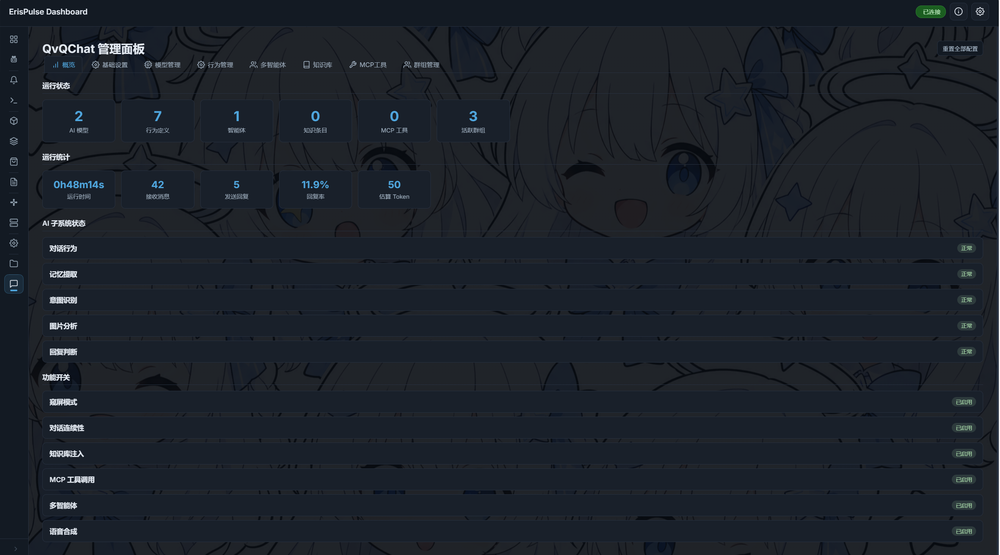
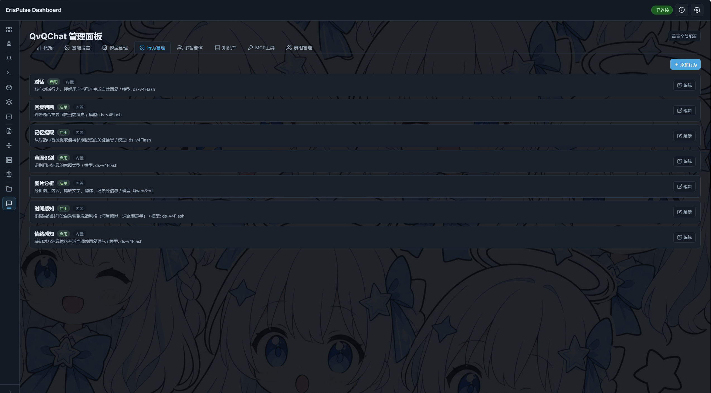
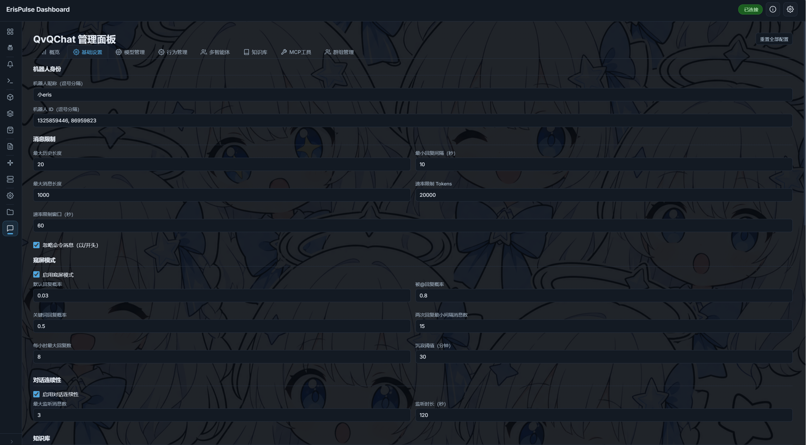
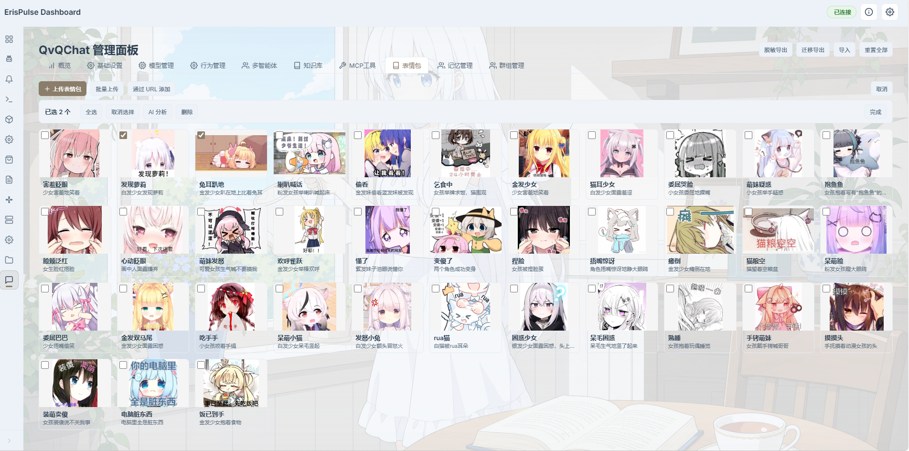

# QvQChat

[](https://www.python.org/)
[](https://github.com/ErisPulse/ErisPulse)
[](LICENSE)
[](https://github.com/wsu2059q/ErisPulse-QvQChat/pkgs/container/erispulse-qvqchat)

让 AI 像真人一样聊天。驱动于 [ErisPulse](https://github.com/ErisPulse/ErisPulse) 框架，全功能 Dashboard 管理。

## 为什么选 QvQChat？

普通的 AI 聊天机器人只会机械回复。QvQChat 让 AI **像真人一样参与群聊**：

- **会窥屏** — 群聊中默默观察，只在被 @、有人叫名字、或话题与自己相关时才开口，不抢话
- **有情绪** — 感知对方语气，开心时一起嗨、难过时温柔安慰
- **知时间** — 清晨迷迷糊糊、上午精力充沛、傍晚放松闲聊，每个时段说话风格都不同
- **打字延迟** — 回复长短不同，打字速度也不同，不会秒回暴露机器人身份
- **会记忆** — 自动记住群友说过的事，下次聊天时自然提起
- **多条消息** — 像真人一样分几条发，而不是一大段丢出去

所有这些行为都是 **可自定义的** — 你可以自由开启/关闭、调整参数、甚至编写自己的行为规则。

## 核心设计

**模型池 + 行为绑定**：添加 AI 模型（支持 OpenAI / DeepSeek / SiliconFlow 等兼容 API），为每个行为分配模型（多模型冗余、故障自动切换）。所有配置通过 Dashboard 完成，无需手动编辑文件。

```
你的 API 模型 ──→ 模型池 ──→ 分配给行为
                              ├── 对话 AI      ──→ 模型 A（主）/ 模型 B（备用）
                              ├── 记忆提取     ──→ 模型 C
                              ├── 意图识别     ──→ 模型 A
                              ├── 图片理解     ──→ 模型 D（vision）
                              └── 回复判断     ──→ 模型 C
```

## Dashboard 管理面板

所有配置一站式完成，修改即时生效。



### 行为管理 — 自由定制 AI 人格

内置 5 种 AI 行为 + 2 种场景行为，还可**自定义行为**。每个行为独立配置提示词、模型、温度等参数。

- **对话 (dialogue)** — AI 回复风格，默认已内置拟人化规则
- **回复判断 (reply_judge)** — 决定是否参与群聊，支持预测模式（低 token）
- **记忆提取 (memory)** — 从对话中自动提取长期记忆
- **意图识别 (intent)** — 区分普通聊天和记忆操作
- **图片理解 (vision)** — 分析图片内容
- **时间感知 (time_aware)** — 根据时段自动调整说话风格
- **情绪感知 (mood_aware)** — 感知对方情绪并调整语气



### 基础设置

窥屏模式、速率限制、消息长度、预测模式等参数一目了然。



### 表情包系统

支持自定义表情包，AI自主根据场景发送




## 功能一览

| 模块 | 说明 |
|------|------|
| 🧠 模型池 | 管理多个 AI 模型，标记能力（对话/视觉/工具调用），故障自动切换 |
| 🎭 行为系统 | 自定义行为、独立提示词、分配模型、触发模式（始终/预测） |
| 👥 多智能体 | 猫娘/傲娇/温柔大姐姐等多种人格模板，可绑定到不同群/用户 |
| 👀 窥屏模式 | 群聊默认观察，被 @ / 叫名字 / 活跃模式时才回复 |
| 🔮 预测模式 | 低 token 模式：累积 N 条消息后批量判断，匹配触发词才进入对话 |
| 🕐 拟人化 | 打字延迟、时间感知、情绪感知、多条消息，让 AI 像真人 |
| 📝 记忆系统 | 自动提取长期记忆，支持群聊混合/仅发送者两种模式 |
| 📚 知识库 | 文档注入对话上下文，支持分类、标签、自动搜索 |
| 🔧 MCP 工具 | 函数调用，让 AI 调用外部 API |
| 🎙️ 语音合成 | <\|voice style="语气"\|> 语音标签，CosyVoice2 合成 |
| 🖥️ Dashboard | 全功能 Web 面板，21 个 API，所有配置即时生效 |

## 快速开始

### Docker（推荐）

```bash
docker run -d --name qvqchat -p 8000:8000 --restart unless-stopped ghcr.io/wsu2059q/erispulse-qvqchat:latest
```

启动后打开 `http://localhost:8000/Dashboard`，适配器、AI 模型、行为配置全部在面板中完成。

### 手动

```bash
pip install erispulse
pip install ErisPulse-QvQChat
ep run
```

## 文档

- [安装指南](INSTALL.md)
- [架构文档](ARCHITECTURE.md)

## 许可证

MIT
